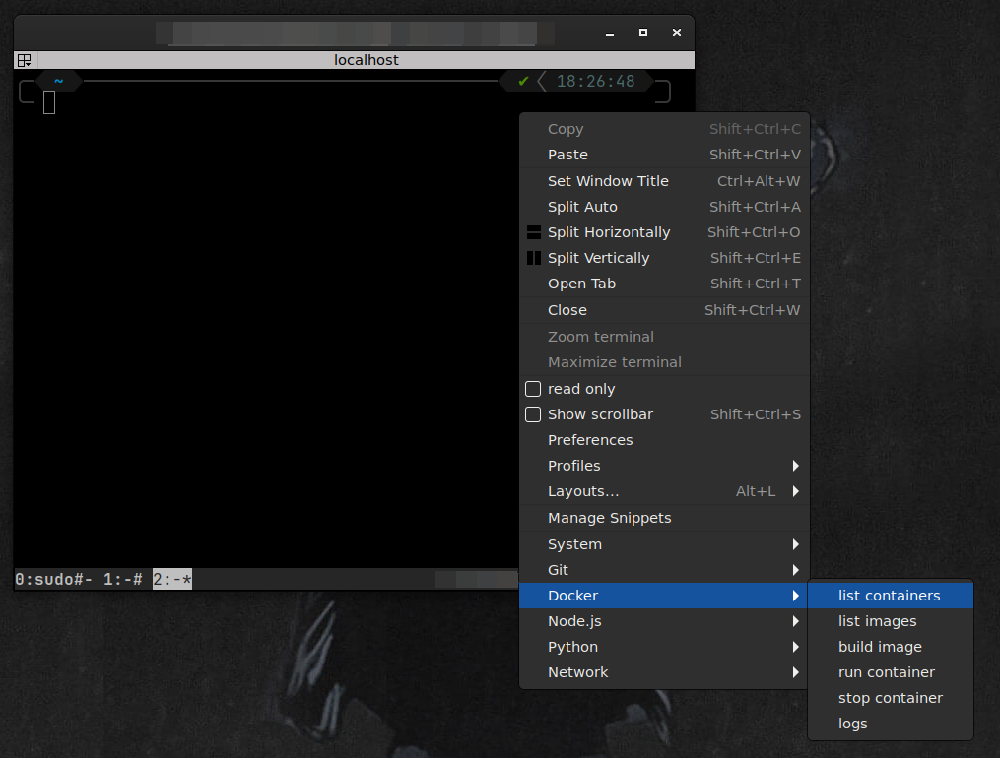
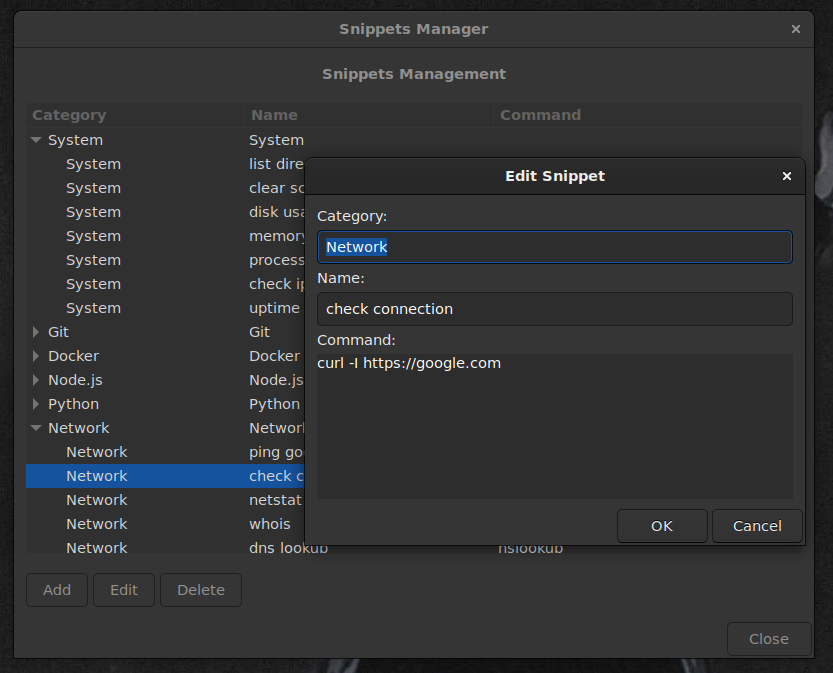

# SnipBox - Terminator Snippet Manager

A plugin for the [Terminator](https://github.com/gnome-terminator/terminator) terminal multiplexer that enables management and quick execution of command snippets directly from a context menu.

## Features

- **Quick Snippet Execution**: Right-click in a terminal and instantly execute predefined command snippets
- **Snippet Organization**: Organize snippets into categories for better management
- **Easy Management**: Built-in dialog with TreeView to add, edit, and delete snippets
- **Persistent Storage**: Snippets are saved in JSON format and automatically loaded on startup
- **Multiline Commands**: Support for complex multi-line command sequences
- **Default Examples**: Comes with useful example snippets to get you started
- **No Dependencies**: Only requires Terminator and Python 3.6+

## Screenshots

### Context Menu with Snippets
Right-click in any terminal to access your organized snippets:



### Snippets Manager Dialog
Easily manage your snippets with a built-in dialog:



## Requirements

- **Terminator** terminal multiplexer
- **Python** 3.6 or higher
- **GTK 3.0** (usually included with Terminator)

## Installation

Choose the installation method that works best for you:

### Option 1: Automated Install (Recommended)

The easiest way to install is using the provided automated script:

```bash
git clone https://github.com/hernancollazo/terminator-snipbox.git
cd snipbox
bash install.sh
```

The script will:
- ✓ Create the plugins directory if needed
- ✓ Copy the plugin file
- ✓ Backup your current Terminator config
- ✓ Add `SnipBoxPlugin` to enabled_plugins
- ✓ **Ask you how to initialize snippets** (examples or empty)

During installation, you'll be prompted to choose:

```
Would you like to:
  1) Use example snippets (recommended for first-time users)
  2) Start with an empty configuration

Choose option (1 or 2):
```

**Option 1** copies the included `snippets.example.json` with useful examples
**Option 2** creates an empty configuration so you can add your own snippets

**Then restart Terminator completely**, and the plugin will be active.

### Option 2: Install via Make

If you prefer using the included Makefile:

```bash
git clone https://github.com/hernancollazo/terminator-snipbox.git
cd snipbox
make install
```

This runs the same `install.sh` script with a convenient shortcut.

### Option 3: Manual Install

If you prefer to install manually:

#### Step 1: Copy Plugin File
```bash
mkdir -p ~/.config/terminator/plugins
cp snippets.py ~/.config/terminator/plugins/
```

#### Step 2: Enable Plugin in Config

Open `~/.config/terminator/config` and add/modify these sections:

```ini
[global_config]
  enabled_plugins = SnipBoxPlugin

[plugins]
  [[SnipBoxPlugin]]
```

If you already have other plugins enabled, add `SnipBoxPlugin` to the list:
```ini
[global_config]
  enabled_plugins = OtherPlugin, SnipBoxPlugin
```

#### Step 3: Create Snippets Config

You can either use the provided examples or start with an empty config:

**Option A: Use Example Snippets**

```bash
cp snippets.example.json ~/.config/terminator/snippets.json
```

**Option B: Start Empty**

```bash
echo '{}' > ~/.config/terminator/snippets.json
```

**Option C: Let the plugin create it**

The plugin will create a default config automatically on first run. You can add snippets through "Manage Snippets" menu.

> **Note:** The automated installer (`bash install.sh`) will ask you which option to use during installation.

#### Step 4: Restart Terminator

Close all Terminator windows and reopen. The plugin should now be active.

### Option 4: Development Install

For development work with editable installation:

```bash
git clone https://github.com/hernancollazo/terminator-snipbox.git
cd snipbox
make install-dev
```

This creates an editable installation that reflects code changes without reinstalling.

### Verify Installation

To verify the plugin is installed correctly:

1. Open Terminator
2. Right-click in any terminal window
3. Look for **"Manage Snippets"** option at the top of the context menu
4. If you see it, installation was successful! ✓

If the option doesn't appear:
- See [Troubleshooting](#troubleshooting) section below
- Run `terminator --debug 2>&1 | grep -i snippet` to check for errors

## Usage

### Adding Snippets

1. Right-click in any terminal
2. Select **Manage Snippets**
3. Click **Add**
4. Fill in:
   - **Category**: Organize snippets (e.g., "Git", "Docker", "System")
   - **Name**: Display name for the snippet (e.g., "list files")
   - **Command**: The command(s) to execute (multiline supported)
5. Click **OK**

### Executing Snippets

1. Right-click in a terminal
2. Navigate to the desired category
3. Click on the snippet name
4. The command will be executed immediately in that terminal

### Editing Snippets

1. Right-click → **Manage Snippets**
2. Select the snippet you want to modify
3. Click **Edit**
4. Modify category, name, or command
5. Click **OK**

### Deleting Snippets

1. Right-click → **Manage Snippets**
2. Select the snippet you want to remove
3. Click **Delete**
4. Changes are saved automatically

## Configuration

Snippets are stored in `~/.config/terminator/snippets.json`. You can edit this file directly for bulk operations:

```json
{
  "Git": {
    "status": "git status",
    "log": "git log --oneline -10",
    "add all": "git add ."
  },
  "Docker": {
    "list containers": "docker ps -a",
    "build image": "docker build -t myapp ."
  }
}
```

### Multiline Commands Example

```json
{
  "Build & Deploy": {
    "build and test": "npm run build && npm test && echo 'Build successful'",
    "docker full workflow": "docker build -t myapp . && docker run -it myapp"
  }
}
```

## Example Snippets

See `snippets.example.json` for a comprehensive collection of example snippets organized by category.

## Development

### Quick Start

```bash
git clone https://github.com/hernancollazo/terminator-snipbox.git
cd snipbox
make install-dev    # Install for development
make test           # Run tests
```

### Development Commands

Use `make` for common development tasks:

```bash
make help           # Show all available commands
```

#### Installation & Testing
```bash
make install        # Install plugin using bash script
make install-dev    # Install for development (editable mode)
make test           # Run test suite
make test-verbose   # Run tests with verbose output
make uninstall      # Remove installed plugin
```

#### Code Quality
```bash
make lint           # Check code style with pylint
make format         # Auto-format code with autopep8
make clean          # Remove build artifacts and cache
```

### Running Tests Manually

```bash
python3 test_snippets.py
```

Tests check:
- ✓ Plugin initialization and metadata
- ✓ Snippet structure validation
- ✓ Method availability
- ✓ JSON configuration validity
- ✓ Plugin state consistency
- ✓ No empty categories or commands

All 14 tests should pass.

### Code Style

Before submitting changes:

```bash
make format         # Auto-format code
make lint           # Check for style issues
python3 test_snippets.py  # Run tests
```

## Limitations

- **Non-interactive**: Commands are fed directly to the terminal, so interactive prompts (like `sudo` password) won't work
- **Working Directory**: Commands execute in the current terminal's working directory
- **No History**: Plugin doesn't track execution history (planned for future version)

## Troubleshooting

### Plugin doesn't appear in menu

**Step 1:** Verify plugin file exists
```bash
ls -la ~/.config/terminator/plugins/snippets.py
```

**Step 2:** Check if plugin is enabled in config
```bash
grep -i "snipbox\|SnipBox" ~/.config/terminator/config
```

Should show:
```
enabled_plugins = SnipBoxPlugin
```

**Step 3:** Ensure Terminator is completely restarted
- Close **ALL** Terminator windows (not just minimize)
- Reopen Terminator
- Right-click and check for "Manage Snippets"

**Step 4:** Check for errors
```bash
terminator --debug 2>&1 | grep -i snippet
```

Should show:
```
PluginRegistry::load_plugins: Importing plugin snipbox.py
```

**Step 5:** If still not working, try full reinstall
```bash
rm -f ~/.config/terminator/plugins/snippets.py
cd terminator-snippets
bash install.sh
```

### Snippets not saving

**Problem:** Changes to snippets don't persist after restarting Terminator

**Solution:**

1. Check directory permissions:
   ```bash
   ls -la ~/.config/terminator/
   chmod 755 ~/.config/terminator/
   chmod 644 ~/.config/terminator/snippets.json
   ```

2. Verify snippets.json is valid JSON:
   ```bash
   python3 -m json.tool ~/.config/terminator/snippets.json > /dev/null && echo "JSON is valid" || echo "JSON is invalid"
   ```

3. Check for errors in terminal output where Terminator was launched

4. Ensure you clicked "OK" in the edit/add dialog (not "Cancel")

### Commands not executing

**Problem:** Snippets appear in menu but nothing happens when clicked

**Causes & Solutions:**

1. **Test the command first:**
   ```bash
   # Try running the command manually in the terminal
   ls -la
   ```

2. **Check command syntax:**
   - Ensure the command is valid
   - No extra spaces at the beginning/end
   - Multiline commands should have proper line breaks

3. **Full paths for some commands:**
   ```bash
   # Instead of: python
   # Use: /usr/bin/python3

   # Instead of: node
   # Use: /usr/bin/node
   ```

4. **Interactive commands won't work:**
   - ❌ `sudo apt-get install package` (needs password)
   - ❌ `read` (needs user input)
   - ✅ `ls -la` (direct command)
   - ✅ `npm install` (non-interactive)

### Plugin enabled but config shows errors

**Problem:** Config file shows errors like "enabled_plugins is invalid"

**Solution:**

Check config format:
```bash
cat ~/.config/terminator/config
```

Should look like:
```ini
[global_config]
  enabled_plugins = SnippetsPlugin

[plugins]
  [[SnippetsPlugin]]
```

If format is wrong, fix it manually or use the installer:
```bash
bash install.sh
```

### Tests fail or plugin seems broken

**Problem:** Something isn't working as expected

**Solution:**

Run the test suite to diagnose:
```bash
python3 test_snippets.py
```

All tests should pass (14 tests). If any fail, check the output for details.

### Need to completely uninstall

**Solution:**

```bash
# Remove plugin file
rm -f ~/.config/terminator/plugins/snipbox.py

# Edit config and remove SnipBoxPlugin from enabled_plugins
nano ~/.config/terminator/config
# Remove "SnipBoxPlugin" from the enabled_plugins line

# Optionally, remove snippets config (this deletes all your snippets!)
rm -f ~/.config/terminator/snippets.json

# Restart Terminator
```

## Contributing

Contributions are welcome! Please feel free to submit a Pull Request or open an issue.

### Development Setup

```bash
git clone https://github.com/hernancollazo/terminator-snipbox.git
cd snipbox
make install-dev
```

### Code Style

Please follow PEP 8 guidelines:
```bash
make format  # Auto-format your code
make lint    # Check for style issues
```

## License

This project is licensed under the MIT License - see the [LICENSE](LICENSE) file for details.

## Acknowledgments

- Built for [Terminator](https://github.com/gnome-terminator/terminator) terminal multiplexer
- Uses GTK 3.0 for UI components
- Inspired by the need for quick command access in terminal workflows

## Support

- **Issues**: Report bugs on GitHub
- **Feature Requests**: Open an issue with the `enhancement` label
- **Questions**: Discussions available on GitHub

## Quick Reference

### Installation Methods

| Method | Command | Time |
|--------|---------|------|
| **Automated (Recommended)** | `bash install.sh` | ~10 seconds |
| **Via Make** | `make install` | ~10 seconds |
| **Manual** | Copy file + edit config | ~2 minutes |
| **Development** | `make install-dev` | ~30 seconds |

### Essential Commands

```bash
# Installation
bash install.sh              # Quick automated install
make install                 # Install via Makefile

# Development
make test                    # Run all tests
make install-dev             # Install for development
make format                  # Auto-format code
make clean                   # Remove build artifacts

# Uninstall
make uninstall               # Remove plugin
# Then manually edit config to remove SnippetsPlugin

# Troubleshooting
terminator --debug 2>&1 | grep snippet    # Check for errors
ls ~/.config/terminator/plugins/snippets.py  # Verify plugin
```

### Common Issues & Solutions

| Issue | Solution |
|-------|----------|
| "Manage Snippets" not visible | Fully restart Terminator, check install |
| Changes not saving | Check permissions: `chmod 755 ~/.config/terminator/` |
| Commands not executing | Test command manually, check syntax |
| Config shows errors | Run `bash install.sh` to fix |

---

**Made with ❤️ for Terminator users**

For issues, questions, or suggestions, please open an issue on [GitHub](https://github.com/hernancollazo/terminator-snipbox/issues).
